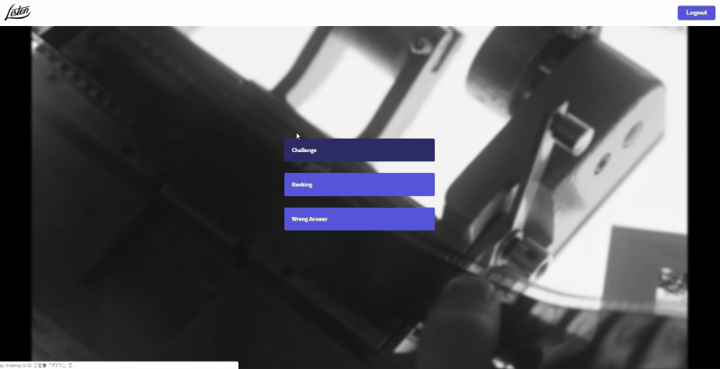

# [Listen Up](https://www.listenup.kr)

# Introduction

**Listen Up**은 '[tvN 놀라운 토요일](https://namu.wiki/w/%EB%86%80%EB%9D%BC%EC%9A%B4%20%ED%86%A0%EC%9A%94%EC%9D%BC), 쟁반 노래방' 등의 형식을 차용한 노래가사 맞추기 어플리케이션 입니다.



[Youtube Link](https://youtu.be/qHC8RNBVnEI)

## Requirements

- Listen Up은 Chrome Browser를 권장합니다.
- Listen Up은 Firebase Social Login을 사용합니다.

## Installation

### Client

```
git clone https://github.com/ddody/listen-up-client.git
cd listen-up-client
npm install
npm start
```

### Server

```
git clone https://github.com/ddody/listen-up-server.git
cd listen-up-server
npm install
npm start
```

## Features

- Firebase Social Login, JSON Web Token을 이용한 회원 인증
- Youtube영상을 이용하여 문제의 시간과 가사등록
- 랜덤하게 문제를 출제하며 정답시 다음문제로 이동
- 순위와 오답을 볼 수 있는 카테고리 제공
- 힌트, 다시듣기, 오답표시 등 기능 구현

### Client-Side Specification

- ES2015
- React
- Redux
- React Router
- Firebase Authentication
- react-player

### Server-Side Specification

- Node.js
- Express
- JSON Web Token Authentication
- MongoDB, mlab
- AWS Certificate Manager SSL인증을 통한 Https Setting

## Deployment

### Client

- Netlify 서비스를 이용하여 client 배포

### Server

- CircleCI 서비스를 이용하여 server 배포

## Version Control

- Web, Server의 독립적인 관리를 위한 GIT Repo 구분

## Challenges

- Youtube player API를 선택하고 사용하기가 쉽지 않았습니다. 프로젝트와의 궁합과 예상치 못한 충돌 등이 있었지만 다행히 잘 해결 하였습니다. 하지만 더 유연한 서비스를 위해 필요기능은 youtube API를 이용하여 직접 구현 하려 합니다.
- AWS 관련한 부분은 이해가 쉽지 않았습니다. 인증서 설정, 서버 배포 등 깊은 학습이 필요할 것 같습니다.
- Database Schema 구성, server API 작성등 server쪽 전반에 대한 부분도 이해가 쉽지 않았습니다. 더 깊은 학습 후 다시 한번 검토를 해 봐야 할 것 같습니다.

## Things to do

개인프로젝트이지만 2주라는 기한을 정하고 시작하였기 때문에 초기기획에 따른 완성에 초점을 두었습니다.\
클라이언트와 서버, 두 부분 다 미숙한 상태였지만 서비스를 완성시켰다는 성취감이 큰 작업이였습니다.\
작업을 할수록 게임성을 높이기 위한 재미요소들이 더 필요하다는 것을 느꼈고 느낀것을 토대로 더 발전시키려 합니다.

- Youtube 부분 직접 구현
- 문제 등급 나누기
- 문제 출제가 가능하도록 유저에 출제자 권한 추가
- 올바르지 않은 문제 신고하기 기능
- 문제 등록 시 자동 등록 기능 추가
- 오답 부분 커뮤니티 기능 강화
- 문제 수정 기능
- 그 밖에 디자인 수정 및 기능 추가

---
Special thanks to [Ken Huh](https://github.com/Ken123777)
